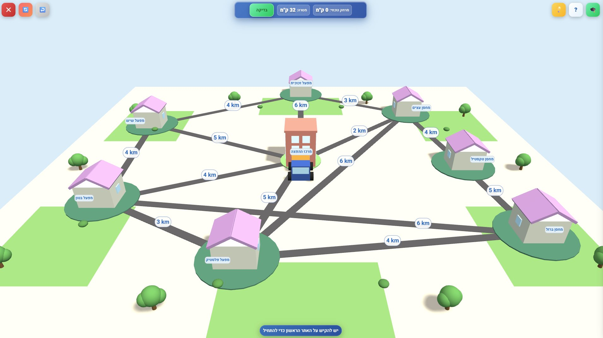
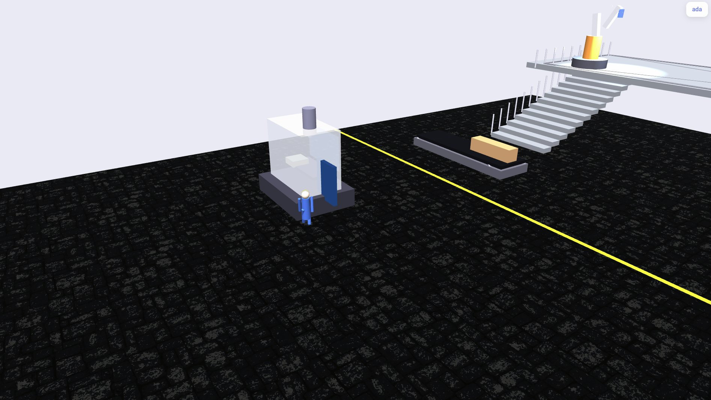
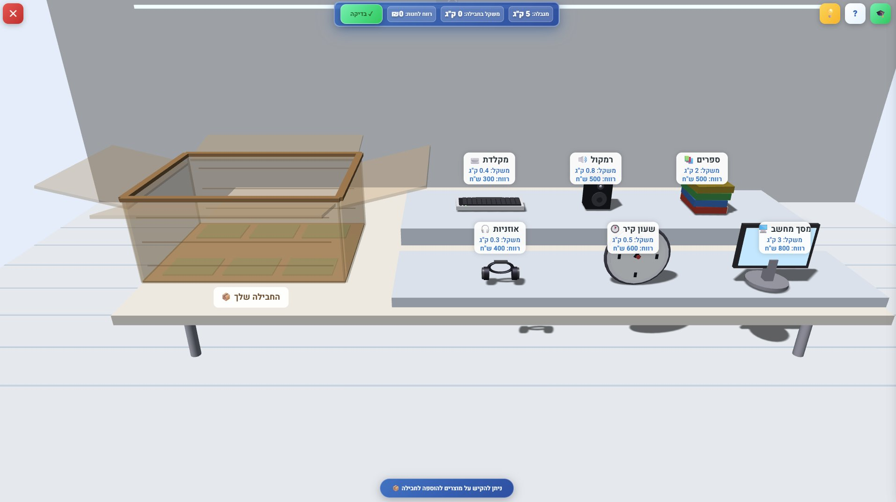
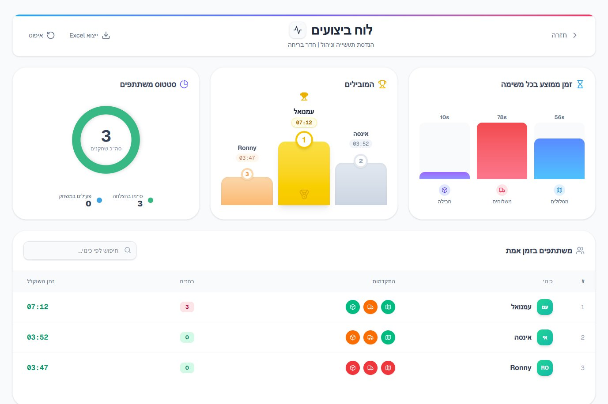

<div align="center">

# 🏭 Digital Escape Room - Open Day

**פרויקט גמר | הנדסת תעשייה וניהול | התמחות מערכות מידע**

[](https://nextjs.org/)
[](https://www.typescriptlang.org/)
[](https://firebase.google.com/)
[](https://www.babylonjs.com/)
[](https://digital-escape-room-seven.vercel.app/)

🔗 **[Live Demo](https://digital-escape-room-seven.vercel.app/)**



</div>

---

## תיאור הפרויקט

פרויקט גמר - שנה ד', הנדסת תעשייה וניהול, עזריאלי מכללה אקדמית להנדסה, ירושלים, 2025-2026. הפרויקט מיושם בפועל בימים הפתוחים של המכללה במהלך שנת הלימודים תשפ"ו.

האפליקציה (Digital Escape Room) היא אפליקציית Web שעומדת בלב סדנת יום פתוח לגיוס סטודנטים חדשים למחלקה. הפרויקט בא לפתור את האתגר של ימים פתוחים - איך נותנים למתעניין טעימה ממה שהתואר כולל בפועל, מעבר לשיחה עם מרצה או עלון מידע. הסדנה (~20 דקות) מתקיימת במעבדת המחלקה וכוללת מצגת פתיחה, חדר בריחה דיגיטלי שבנינו באפליקציה - סביבת מפעל תלת-ממדית שהמשתתף צריך לפתור בה 3 חידות הנדסיות כדי "לצאת", דשבורד תוצאות חי על מסך גדול, הדגמת רובוט פיזי, ושיחה עם בוגרים.

---

## חדר הבריחה הדיגיטלי

המשתתף נכנס לסביבת מפעל תעשייתי תלת-ממדית (Babylon.js). כדי "לצאת" מהמפעל, עליו לעבור בשלוש תחנות ולפתור בכל אחת חידה שעוצבה כמשחק תלת-ממדי - כל חידה מבוססת על בעיה מתחום הנדסת תעשייה וניהול.

| מה עושים | אלגוריתם | משחק |
|----------|-----------|------|
| סידור נקודות עצירה למסלול הקצר ביותר. ניקוד לפי קרבה לאופטימום ומהירות | Travelling Salesman Problem | 🚚 **מאסטר המסלולים** |
| שיבוץ 4 שליחים על אופנועים ל-4 הזמנות כדי למזער עלות נסיעה כוללת | Hungarian Algorithm | 🏍️ **מאסטר המשלוחים** |
| בחירת מוצרי טכנולוגיה לחבילת משלוח עם מגבלת משקל - המטרה לארוז כמה שיותר ערך במשקל הנתון | Knapsack Problem | 📦 **חבילה למשלוח** |

בסיום הסדנה, רובוט במעבדה מדגים את הפתרון של חידת ה-Knapsack פיזית עם מוצרים מודפסים בתלת-ממד.

<div align="center">


</div>

---

## דשבורד זמן אמת

מוקרן על המסך הגדול במעבדה במהלך המשחק. מעבר ליצירת אווירה תחרותית, הדשבורד חושף את המתעניינים לעולם מערכות המידע - ויזואליזציה של נתונים בזמן אמת. כולל פודיום (3 מובילים), גרפי ביצועים (Chart.js), טבלת משתתפים מפורטת, ייצוא CSV, וכפתורי איפוס לאדמין.

<div align="center">

</div>

---

## Tech Stack

| Technology | Version | Usage |
|------------|---------|-------|
| **Next.js** | 16.1 | App Router, SSR |
| **React** | 19.2 | UI |
| **TypeScript** | 5.9 | Type Safety |
| **Tailwind CSS** | 4 | Styling & Responsive |
| **Babylon.js** | 8.39 | 3D Factory Tour + Games |
| **GSAP** | 3.13 | Animations |
| **Chart.js** | 4.5 | Dashboard Charts |
| **Firebase Auth** | - | Google + Anonymous |
| **Cloud Firestore** | - | Game Data, Feedback (realtime) |
| **Vercel** | - | Deployment + CI/CD |

---

## מבנה הפרויקט

```
digital-escape-room/
├── app/
│   ├── page.tsx                  # כניסה (Google / אורח)
│   ├── layout.tsx                # RTL עברית + providers
│   ├── dashboard/                # דף ראשי
│   ├── feedback/                 # טופס משוב + דשבורד אדמין
│   ├── info/                     # מידע על התואר
│   ├── leaderboard/              # לוח תוצאות + פודיום + גרפים
│   └── games/play/
│       ├── FactoryTour.tsx       # סיור המפעל 3D
│       ├── TourIntro.tsx         # מסך פתיחה (GSAP)
│       ├── factory/              # בניית הסצנה התלת-ממדית
│       ├── tsp/                  # חידת הסוכן הנוסע
│       ├── hungarian/            # חידת האלגוריתם ההונגרי
│       └── knapsack/             # חידת תרמיל הגב
│
├── lib/
│   ├── firebase.ts               # חיבור Firebase
│   ├── gameService.ts            # פעולות Firestore
│   ├── feedbackService.ts        # פעולות משוב
│   ├── admin.ts                  # הרשאות אדמין
│   ├── types.ts
│   ├── contexts/GameContext.tsx   # state גלובלי
│   └── hooks/                    # useAuth, useLeaderboard, useAdmin
│
└── public/audio/                 # אפקטי קול
```

---

## הרצה מקומית

**דרישות:** Node.js 18+, חשבון Firebase עם פרויקט פעיל

```bash
git clone https://github.com/emanuel-chen-openday-project/digital-escape-room.git
cd digital-escape-room
npm install
```

צור קובץ `.env.local` בתיקיית השורש:

```env
NEXT_PUBLIC_FIREBASE_API_KEY=
NEXT_PUBLIC_FIREBASE_AUTH_DOMAIN=
NEXT_PUBLIC_FIREBASE_PROJECT_ID=
NEXT_PUBLIC_FIREBASE_STORAGE_BUCKET=
NEXT_PUBLIC_FIREBASE_MESSAGING_SENDER_ID=
NEXT_PUBLIC_FIREBASE_APP_ID=
NEXT_PUBLIC_FIREBASE_MEASUREMENT_ID=
```

```bash
npm run dev       # שרת פיתוח
npm run build     # בניה לייצור
npm run lint      # בדיקת קוד
```

---

## רקע אקדמי

פרויקט גמר - שנה ד', הנדסת תעשייה וניהול, עזריאלי מכללה אקדמית להנדסה, ירושלים.

### מתודולוגיה

הפרויקט משלב שלוש מתודולוגיות:

**מחקר מבוסס עיצוב (DBR)** - מסגרת המחקר הכוללת. כל יום פתוח מהווה מחזור איטרציה שבו נאספים נתונים (משוב, תוצאות משחק, שיעורי הרשמה), מנותחים, ומיושמים שיפורים למחזור הבא.

**מודל פיתוח חינוכי (ADDIE)** - ניתוח, עיצוב, פיתוח, יישום, הערכה. משמש לתכנון החידות והסדנה עצמה - מניתוח קהל היעד ועד הערכת האפקטיביות.

**ניהול פיתוח (Agile Kanban)** - ניהול שוטף של הפיתוח באמצעות לוח קנבאן ב-Trello, עם עדכונים שוטפים לפי סדרי עדיפויות משתנים.

---

## צוות

<div align="center">

**חן ביאזי** · **עמנואל נתניה**

פיתוח, עיצוב, מחקר

</div>
